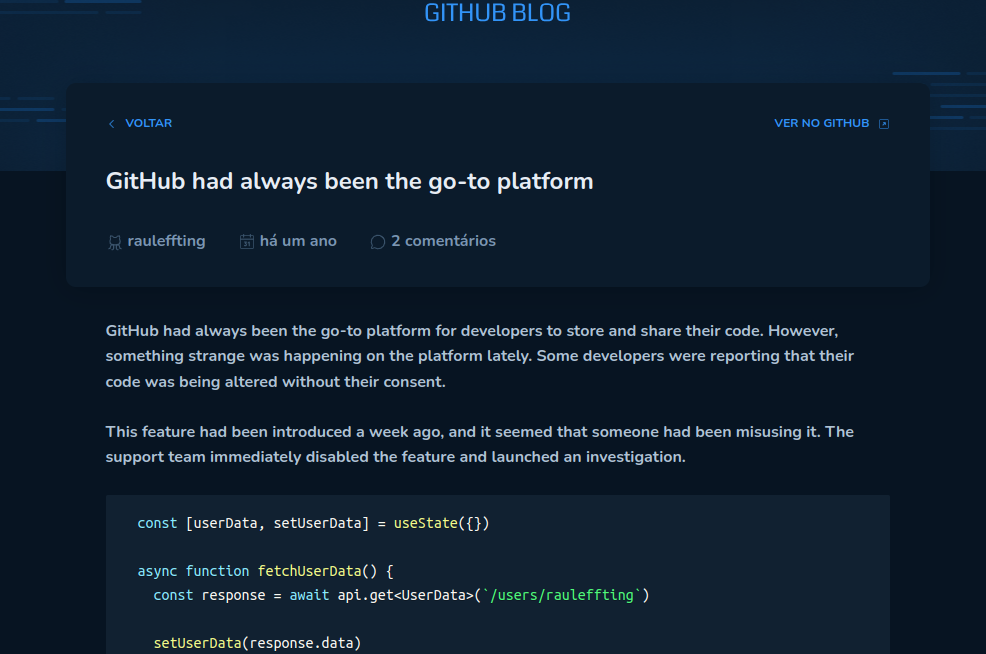

  

 

# Projecto

Este projecto, foi desenvolvido no desafio de **Reactjs** do ignite.

## Tecnologias usadas

- [Vite](https://vitejs.dev)
- [ReactJS](https://reactjs.org)
- [TypeScript](https://www.typescriptlang.org/)
- [Styled Components](https://styled-components.com)

## Para rodar o projecto

Para este projecto usei o **nodejs 20.10.0**. para rodar o projecto na sua maquina use os seguintes passos.

1. Clone o projecto na sua maquina usando o seguinte link https://github.com/alfiadoDev/desafio03-reactjs-github-blog.git

2. Abra a sua linha de comandos, ou no **VS CODE** na linha de coomandos e execute o seguinte ``yarn`` ou ``npm install`` se estiver usando o gerenciador de pacotes **NPM**
   
3. Por fim ainda na linha de comandos, execute ``yarn dev`` ou ``npm dev``

4. Para mudar o nome de usuario e repositorio do projecto, edite o arquivo **.env** na raiz do projecto.

## 🖼️ Layouts do Projecto

### Pagina Home ou Principal ``/``

  

 

### Pagina de Post ou issue ``/issue/id``

  

